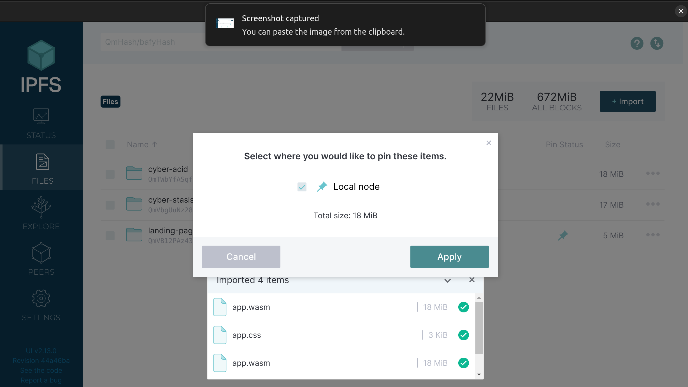

# Cyber Acid

  


 Cyber Acid is a political simulator based on the liquid democracy concept. It is designed as an integration module that works with Cyber Stasis - the moneyless economy simulator.


## Screenshots

  

<a  display="inline"  href="./assets/how-to.png?raw=true">


</a>

  

<a  display="inline"  href="./assets/list-shortages.png?raw=true">


</a>

  

<a  display="inline"  href="./assets/list-solutions.png?raw=true">


</a>

  

<a  display="inline"  href="./assets/suggest-solution.png?raw=true">


</a>

  

<a  display="inline"  href="./assets/delegate-vote.png?raw=true">


</a>

  
## Features

  

*  **Check shortages** - Review pressing issues.

*  **Suggest a solution** - Contribute with your expertise.

*  **Vote for solutions** - Vote for the best solution.

*  **Delegate your vote** - Not competent? Delegate your vote.

*  **Infinite delegation** - Delegation can be chained for maximum participation.

*  **Cross delegation** - Cross delegation is also supported.
  

## How to Play

  

The game runs on the public IPFS network. In order to play it follow the steps below:

  

1. Install the official IPFS Desktop http://docs.ipfs.io/install/ipfs-desktop/

2. Install IPFS Companion http://docs.ipfs.io/install/ipfs-companion/

3. Clone https://github.com/stateless-minds/go-ipfs to your local machine, build it with `make build` and run it with the following command: `~/cmd/ipfs/ipfs daemon --enable-pubsub-experiment`

4. Follow the instructions here to open your config file: https://github.com/ipfs/go-ipfs/blob/master/docs/config.md. Usually it's `~/.ipfs/config` on Linux. Add the following snippet to the `HTTPHeaders`:

```{

"API": {

"HTTPHeaders": {

"Access-Control-Allow-Origin": ["webui://-", "http://localhost:3000", "http://bafybeicm22vjv5rqalbekqbhxom47rnotvgwnxmqnhimnklqqky73ys55i.ipfs.localhost:8080", "http://127.0.0.1:5001", "https://webui.ipfs.io"],

"Access-Control-Allow-Credentials": ["true"],

"Access-Control-Allow-Methods": ["PUT", "POST"]

}

},

```

6. Navigate to <a  href="https://ipfs.io/ipfs/QmTWbYfASqfEkLC6LkdemEVczoffoH8xfFgWkYLzxMU5bF">https://ipfs.io/ipfs/QmTWbYfASqfEkLC6LkdemEVczoffoH8xfFgWkYLzxMU5bF</a> and let's simulate the future together!

7. If you like the game consider pinning it to your local node so that you become a permanent host of it while you have IPFS daemon running




  

Please note the game has been developed on a WQHD resolution(2560x1440) and is currently not responsive or optimized for mobile devices. For best gaming experience if you play in FHD(1920x1080) please set your browser zoom settings to 150%.


## Roadmap

1. Make reputation index context/category based

2. Add delegate rankings

3. Make voting time-restricted

  

## Acknowledgments

  

1.  <a  href="https://go-app.dev/">go-app</a>

2.  <a  href="https://ipfs.io/">IPFS</a>

3.  <a  href="https://berty.tech/">Berty</a>

4. All the rest of the authors who worked on the dependencies used! Thanks a lot!

  

## Contributing

  

<a  href="https://github.com/stateless-minds/cyber-acid/issues">Open an issue</a>

  

## License

  

Stateless Minds (c) 2022 and contributors

  

MIT License
